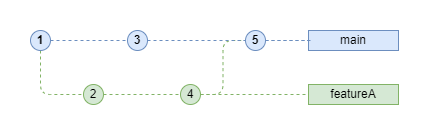

# 📝 Ejercicio ToDo App

*:warning: Importante:* escribir nombre y número de estudiante en la línea siguiente:  
- Nombre: XXXXXXXX  
- Número de estudiante: XXXXXXXX

Una vez creado el repositorio GitHub, debe clonarlo para trabajar localmente. Debe instalar previamente: **Git**, **Visual Studio Code** y haber realizado la autenticación en **GitHub**.

- Copiar la <url> del repositorio usando el botón **(<> Code) / Local**.
- Abrir la terminal de comandos.
    - `git clone <url>`
    - `cd <directorio>` 

## Parte A 📊

Dada la siguiente imagen de un grafo de dependencias entre ramas de un repositorio git, se pide:

- Escribir en orden cronológico los comandos git que se utilizaron para poder realizar el grafo de la imagen.



*Aclaraciones:*
- La cronología se lee de izquierda a derecha.
- Cada nodo es un commit (usar como mensaje el número de commit).
- Hay dos ramas con su nombre correspondiente.

**Escribir la secuencia de comandos en un issue GitHub con el nombre "Parte A".**

Ejemplo:
```
git commit -a -m"1"
git branch featureA
...
```

## Parte B 🚀

Usted es el encargado de implementar dos nuevas funcionalidades en un proyecto. Es una **ToDoApp** que permite crear tareas, marcarlas como completadas y eliminarlas.
Los cambios se documentan en el archivo Markdown `doc/informe.md`. El código se encuentra en `src/todoapp.js`.

Los cambios se deben codificar en el repositorio local y posteriormente hacer push al repositorio remoto GitHub. Cada feature se debe codificar en una rama independiente. Todas las ramas deben quedar en el repositorio remoto al finalizar.

### 1. 📄 Documentación de cambios 
   - Modificar el archivo `doc/informe.md` agregando un título `Nuevas features de ToDoApp` y una lista con dos ítems de texto: `uncomplete` y `addTimer`.
   - Realizar commit del cambio en la rama `main`.
   - Realizar push de la rama `main` al repositorio remoto.

### 2. 🛠️ Feature 'uncomplete'
- A partir de `main`, crear una nueva rama `uncomplete` y moverse a dicha rama para agregar la feature.
- Agregar en el archivo `src/todoapp.js` el siguiente código:
 
    ```javascript
    const uncompleteTask = (name) => {
        const task = tasks.find(task => task.name === name);
        task.done = true;
    }
    ```
- Realizar commit del cambio en la rama.
- Realizar push de la rama `uncomplete` al remoto.

### 3. ⏲️ Feature 'addTimer'
- Moverse a la rama `main`.
- A partir de `main`, crear una nueva rama `addTimer` y moverse a dicha rama para agregar la feature.
- Agregar en el archivo `src/todoapp.js` el siguiente código:
  
    ```javascript 
    const addTimer = (name, time) => {
        const task = tasks.find(task => task.name === name);
        task.timer = time;
    }
    ```
- Realizar commit del cambio en la rama.
- Realizar push de la rama `addTimer` al remoto.

### 4. 🔄 Merge de features
- Moverse a la rama `main`.
- Realizar merge de la rama `uncomplete` a `main`.
- Realizar merge de la rama `addTimer` a `main`.
- Realizar push de la rama `main` al remoto.

### 5. 🏷️ Tag e historial
- Agregar un tag `v1.0` al último commit de `main`.
- Obtener un historial de los cambios realizados (opciones `--oneline --graph`).
- Capturar la pantalla de la consola que muestra el historial.

**Subir la captura de pantalla en un issue en GitHub con el nombre "Parte B".**
